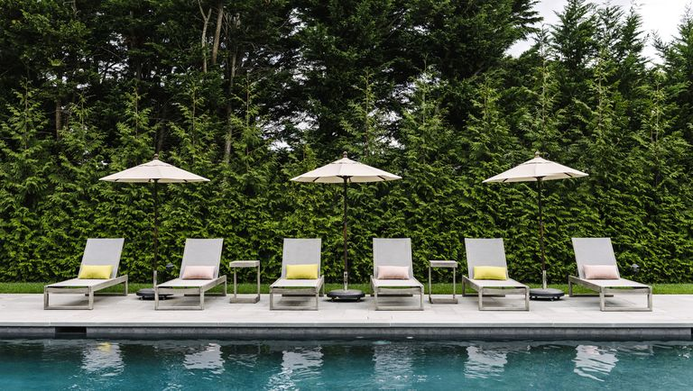

# Welcome to my site!

### Hi, I'm Clint! I'm currently taking my Master's degree of Coastal Engineering at the University of Tokyo, Japan. 

<!----->

### It's my first time to blog and make a website, but generally I will be talking about a lot of stuff as a grad student in Tokyo, together with Fitness tips, Coastal engineering (which means beaches, waves, storms, and tsunamis), and basically everything! Stay tuned :D.   

<!----->

